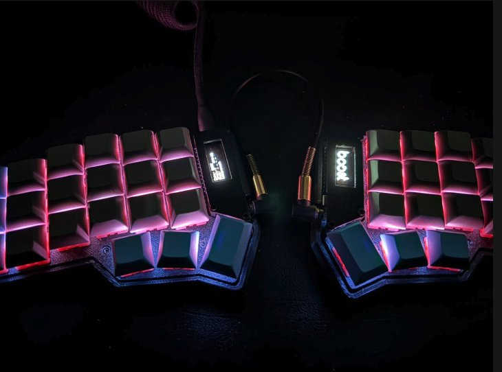

# Teclado Corne kchipanach — Firmware Vial



Configuración completa del teclado **Corne (crkbd)**: firmware Vial
sobre `vial-qmk`, con RGB Matrix, capas en español, y pantallas OLED
personalizadas (logo [boost](https://tryboost.app) + información en vivo).

Este repo guarda todo lo necesario para **reconstruir, reflashear y seguir
ajustando** el teclado.

## Hardware

- **Teclado:** Corne / crkbd rev1 (split 3x6 + 3 pulgares por mitad).
- **Controlador:** RP2040 (formato Pro Micro, conversor `rp2040_ce`).
  - Se flashea arrastrando un `.uf2` al disco `RPI-RP2`.
- **Iluminación:** RGB Matrix, **54 LEDs** (12 underglow + 42 por tecla),
  driver ws2812, expuesto a Vial vía **VialRGB**.
- **Pantallas:** 2 OLED SSD1306 128x32, montadas en **landscape** (21 col x 4 filas).
- **Handedness:** `MASTER_LEFT` (la mitad izquierda es siempre la master / la
  que se conecta por USB). No usa `EE_HANDS`.

## Estructura del repo

```text
firmware/     Archivos del keymap (lo que se compila)
  keymap.c        Capas + lógica de OLED
  config.h        MASTER_LEFT, RGB Matrix, entradas de Vial, unlock combo
  rules.mk        Features activadas
  boost_logo.h    Logo boost como array C (128x32, formato página SSD1306)
  vial.json       Definición de Vial
logo/         Origen y conversión de la imagen del OLED
  logo_white_original.png   Imagen original
  boost_oled_128x32.png     Convertida a 1-bit para el OLED
  boost_oled_PREVIEW.png    Previsualización ampliada
  gen_logo.py               Script de conversión (PNG -> array C)
build/        Firmware compilado listo para flashear
  crkbd_rev1_boost_rp2040_ce.uf2
```

## Entorno de compilación

- **Repo base:** `vial-qmk` (rama `vial`) clonado en `~/vial-qmk`.
- **Keymap:** `~/vial-qmk/keyboards/crkbd/keymaps/boost` (copia de este repo).
- **CLI:** `qmk` 1.2.0 (instalado vía pip en el Python de pyenv).
- **Toolchain ARM:** xpack `arm-none-eabi-gcc` 15.2.1 en
  `~/toolchains/xpack-arm-none-eabi-gcc-15.2.1-1.1` (el de Homebrew no trae
  newlib, por eso se usa este).

### Compilar

```bash
export PATH="$HOME/toolchains/xpack-arm-none-eabi-gcc-15.2.1-1.1/bin:$PATH"
cd ~/vial-qmk
# (copiar primero los archivos de firmware/ a keyboards/crkbd/keymaps/boost/)
qmk compile -kb crkbd/rev1 -km boost -e CONVERT_TO=rp2040_ce
```

Genera `~/vial-qmk/crkbd_rev1_boost_rp2040_ce.uf2`. Usa ~3% de la flash del RP2040.

## Flashear (las dos mitades, mismo archivo)

Se flashea **una mitad a la vez**. Orden seguro para desmontar y entrar al
bootloader:

1. **Desconecta el USB** (la fuente de energía).
2. **Quita el cable TRRS** de ambos lados (los dos jacks).
3. Conecta por USB **solo la mitad que vas a flashear** (por ejemplo, la izquierda).
4. **Doble toque al botón de reset** de la placa → entra en bootloader y aparece
   el disco `RPI-RP2`.
5. Copia el `.uf2` al disco (esto es lo que la flashea):

   ```bash
   cp build/crkbd_rev1_boost_rp2040_ce.uf2 /Volumes/RPI-RP2/
   ```

   La mitad se reinicia sola (el disco se desmonta = flasheó).
6. Desconecta esa mitad, conecta la otra y repite los pasos 3 a 5.

### Reconectar para uso normal (orden correcto)

Cuando **ambas mitades ya están flasheadas**:

1. Conecta el **cable TRRS en ambos lados** (une las dos mitades).
2. **Solo cuando están unidas por el TRRS**, conecta el **USB en el lado master
   (el izquierdo)**.

> Si solo cambias la pantalla del master, basta reflashear la **izquierda**.

## OLED

Los OLED son **landscape (21 columnas x 4 filas)**.

- **Derecha (slave):** logo [boost](https://tryboost.app) (imagen cruda vía `oled_write_raw_P`).
- **Izquierda (master):** información en vivo:

  ```text
  Capa: BASE
  Tecla:H   WPM:42
  Mods: S - - G
  kchipanach
  ```

  - Última tecla mostrada como **letra** (no código). `KC_SCLN` se muestra como
    `N` (representa la ñ).
  - WPM = velocidad de escritura (palabras por minuto).
  - Mods = Shift / Ctrl / Alt / Gui-Cmd activos.

## Capas y teclado

Base tomada de [renzoqc/renzodev-corne-keyboard](https://github.com/renzoqc/renzodev-corne-keyboard),
en **códigos US/ANSI**. La Mac usa el layout **"LatinoPer"**, que traduce esos
códigos a español: la **ñ sale sola** en la tecla `KC_SCLN`.

🇵🇪 Mi distribución **LatinoPer** y cómo instalarla están en [macos-latinoper/](macos-latinoper/).

📋 **Tu distribución de teclas completa, para verla sin abrir Vial:** [keymap.txt](keymap.txt).

Capas: `BASE` (0), `NAV` (1), `SYM` (2), `NUM` (3), `ADJUST` (4, tri-layer SYM+NUM).

Pulgares (tap-hold para no perder acceso a capas):

- Izquierda: `Opt` · `Cmd` · `Espacio`/hold SYM
- Derecha: hold NAV · `Ctrl` · `Enter`/hold NUM

## Configurar en vivo con Vial (sin reflashear)

Casi todo se ajusta en caliente desde la app **Vial** (descarga en
[get.vial.today](https://get.vial.today) o web en [vial.rocks](https://vial.rocks)
con Chrome/Edge). Conecta la mitad izquierda por USB y Vial detecta el teclado.

- **Desbloqueo:** para usar Matrix tester y funciones sensibles, ve a
  *Security/Unlock* y mantén el combo **Tab + Q** unos segundos.
- **Teclas / capas:** pestaña *Keymap* — elige capa, clic en tecla, asigna.
- **LEDs:** pestaña de iluminación (VialRGB) — efecto, color, brillo, velocidad.
- **Combos / Tap Dance / Key Overrides / Macros:** sus pestañas (todas activadas).

Los cambios se guardan en la memoria del teclado al instante.

## Pendiente / por afinar

- **Símbolos de las capas SYM/NUM:** están en posiciones US; ajustarlos en Vial
  para que coincidan con el layout LatinoPer.
- Posición fina de los pulgares (mover en Vial al gusto).

## Licencia y créditos

Este firmware deriva de [QMK](https://github.com/qmk/qmk_firmware) y
[vial-qmk](https://github.com/vial-kb/vial-qmk), por lo que se distribuye bajo la
**GNU GPL v2** — ver [LICENSE](LICENSE).

- Distribución de capas inspirada en [renzoqc/renzodev-corne-keyboard](https://github.com/renzoqc/renzodev-corne-keyboard).
- Hardware Corne (crkbd) diseñado por [foostan](https://github.com/foostan/crkbd).
- Logo del OLED: [boost](https://tryboost.app).
